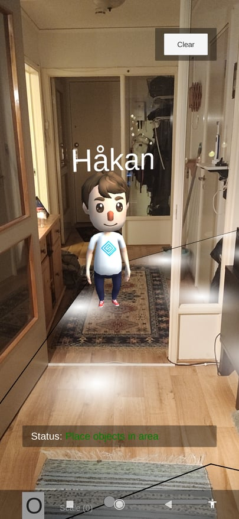
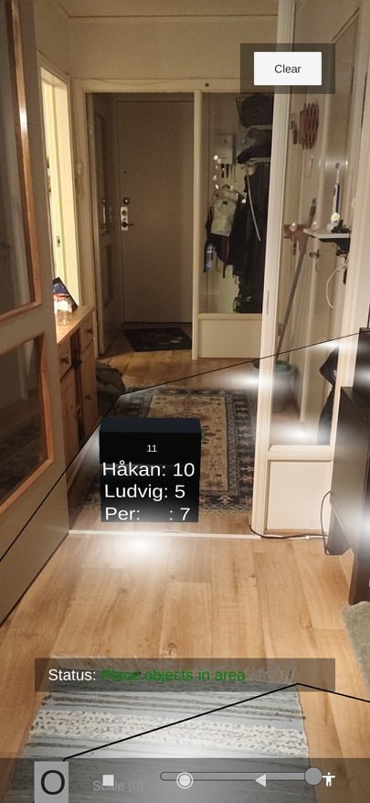

# Social-AR
Test cases for investigating how augmented reality (AR) can be used in mobile fitness apps to improve social interaction when working out online with other people. 

The tests are developed in Unity with AR Foundation. The tests consis of two scenarios which are about AR and social interaction.
  
<table>
  <tbody>
    <tr>
      <td>Scenario 1</td>
      <td>Scenario 2</td>
    </tr>
    <tr>  
      <td></td>
      <td></td>
    </tr>
  </tbody>
</table>
